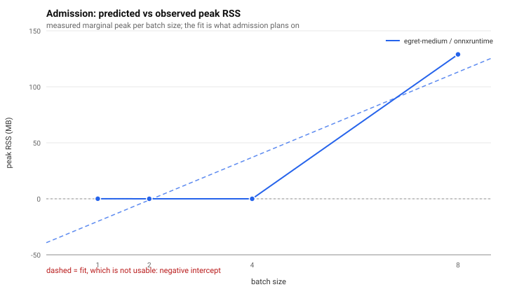

# ForgeSight benchmark report

- protocol version: `1`
- measured: 2026-10-05T13:37:23.850360+00:00
- host: Apple M5 4P+6E, 27.0.1, torch 2.14.1, ORT 1.30.0, measured 2026-10-05T13:37:23, host 5366c41586b5836d
- git sha: `bb0ccb6c84533e4124fffcd1409520b53a7ebede`
- power source during capture: battery (Low Power Mode ON)
- free memory before/after: 0.2163 / 0.2089

## Conditions that would normally block measurement

- on_battery: running on battery power; connect AC to measure

> These numbers were taken under conditions the protocol would refuse by default. They are reported with the caveat rather than discarded, and should not be compared with a run taken under nominal conditions.

## Limits

- All pages in this report were generated by this repository and are labelled SYNTHETIC. They are not real documents.
- The synthetic box conventions do not match DocLayNet's, so the absolute mAP figures here are NOT comparable with published numbers. Only relative comparisons between candidates on the same dataset are meaningful.
- Every measurement below is valid only for the host, OS and library versions in the environment manifest, and only for the date it was taken.
- A candidate that happens to suit the synthetic convention better can score well here and worse on real pages. That caveat applies to every comparison.

## Datasets

| dataset | version | manifest hash(es) | synthetic |
|---|---|---|---|
| synth-clean | 1 | `084cfbdeaaf5201d`, `69a20aa9773b472a`, `7f665e119a500469`, `9de75dab8f9b9978`, `bd1f1d3d55af621b` | yes |
| synth-scan | 1 | `1eec43ca46d8d3fa` | yes |

> More than one manifest hash under a single version means builds with different content or different page counts were both loaded. Each is a distinct dataset; they are not interchangeable.

## Throughput and latency

Queue-inclusive latency includes the wait for a worker; service time does not. Both are reported because a single unnamed latency number is how a benchmark misleads.

| configuration | pages/s (median) | pages/s range | queue-incl. p95 (ms) | p95 95% CI | service p50 (ms) | peak RSS | stability |
|---|---|---|---|---|---|---|---|
| `egret-medium/onnxruntime/pil_bilinear/b1/t4` | 4.917 | 4.639–4.931 | 233.22 | [231.09, 244.78] | 193.31 | 911.00 MB | stable |
| `egret-medium/onnxruntime/pil_bilinear/b4/t4` | 4.897 | 4.888–4.923 | 236.40 | [235.01, 238.38] | 199.16 | 926.80 MB | stable |

### Comparisons

- egret-medium/onnxruntime/pil_bilinear/b1/t4 sustained 4.917 pages/s against 4.897 pages/s for egret-medium/onnxruntime/pil_bilinear/b4/t4 on the same host in the same run, a factor of 1.00 (queue-inclusive p95 [231.09, 244.78] ms vs [235.01, 238.38] ms, 95% bootstrap CI over 3 trials).

## Memory model and admission

| quantity | value |
|---|---|
| steady state M0 | -39.20 MB |
| marginal cost per 640x640 item (m_item) | 19.05 MB |
| max fit residual | 37.01 MB |
| fit usable for admission | **no** |
| admission mispredictions | 0 |
| observations | 4 |

> **The linear memory model did not reproduce on this host.** the fit gives a negative intercept (-39183405 B), i.e. it claims memory is released as the batch shrinks; RSS is a high-water mark so that is impossible. Admission falls back to the largest measured peak. This is a result, not a defect in the measurement: it means admission on this host is driven by measured peaks rather than by a fitted line, and that a controller trusting the fit would be operating on fiction.

Marginal peak above the post-warm baseline, per batch size:

| batch size | marginal peak | high-water including baseline |
|---|---|---|
| b=1 | 0.08 MB | 1,237.20 MB |
| b=2 | 0.00 MB | 1,237.10 MB |
| b=4 | 0.00 MB | 1,237.10 MB |
| b=8 | 128.91 MB | 1,366.00 MB |

Method: baseline taken after a warm pass at every batch size, so each figure is the marginal peak above it; measuring ascending batch sizes against a cold baseline would report a high-water staircase that no linear model fits.

Admission predicts peak RSS as `M0 + b * m_item` and picks the largest batch that fits the budget. The prediction is checked against the measured marginal peak on every batch; the misprediction count above is that check, reported rather than assumed correct.

## Raw samples

Every number above is read from one of these files. Nothing in this report is computed independently of them.

- `egret-medium_onnxruntime_pil_bilinear_b1_t4_t0.json`
- `egret-medium_onnxruntime_pil_bilinear_b1_t4_t1.json`
- `egret-medium_onnxruntime_pil_bilinear_b1_t4_t2.json`
- `egret-medium_onnxruntime_pil_bilinear_b4_t4_t0.json`
- `egret-medium_onnxruntime_pil_bilinear_b4_t4_t1.json`
- `egret-medium_onnxruntime_pil_bilinear_b4_t4_t2.json`

